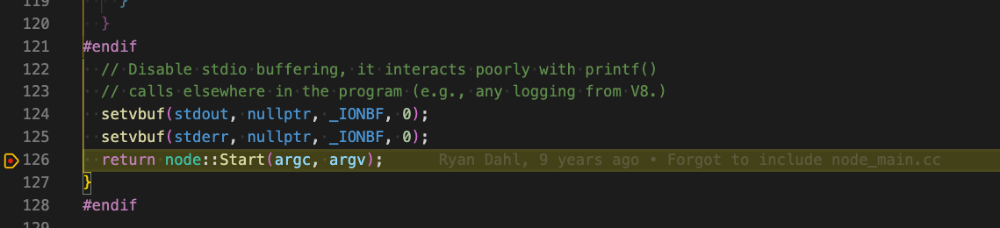

## 准备阶段

1. 编辑器: [Visual Studio Code](https://code.visualstudio.com/)
2. VScode plugin: [C/C++ (Microsoft)](https://github.com/microsoft/vscode-cpptools)
3. node源码一份: [https://github.com/nodejs/node](https://github.com/nodejs/node)

## 编译

1. 进入node源码目录
2. 执行 `./configure --debug`, 通过configure配置生成makefile的配置
3. `make -C out BUILDTYPE=Debug -j 4` 编译。make会读取makefile的配置，进行编译，生成可执行文件
```
make -h -打印make使用帮助，以下摘取使用到部分
-----
-C DIRECTORY, --directory=DIRECTORY Change to DIRECTORY before doing anything.
-j [N], --jobs[=N] Allow N jobs at once; infinite jobs with no arg.
-----

Makefile 注释
-----
BUILDTYPE=Debug builds both release and debug builds. If you want to compile
just the debug build, run `make -C out BUILDTYPE=Debug` instead.
-----
```
4. 等待(第一次编译是极其漫长的过程)...

## 开始调试

### C++调试 --看一个简单的nodejs文件运行

#### 配置vscode插件
参考以下配置：
```json
{
    "version": "0.2.0",
    "configurations": [
        {
            "name": "(lldb) Launch",
            "type": "cppdbg",
            "request": "launch",
            "program": "${workspaceFolder}/out/Debug/Node",
            "stopAtEntry": false,
            "cwd": "${workspaceFolder}",
            "environment": [],
            "externalConsole": true,
            "MIMode": "lldb"
        },
        {
            "type": "node",
            "request": "attach",
            "name": "Attact Program",
            "port": 9229
        }
    ]
}
```
#### node源码调试
1. node入口集中在文件 node/src/node_main.cc中, 在node::Start打断点


按上图一步步往下就可以nodejs从运行开始到结束的整体流程

#### js代码调试

1. 修改node源码执行make, 修改`deps/uv/src/unix/core.c`
```c
while (r != 0 && loop->stop_flag == 0) {
    uv__update_time(loop);
    printf("*timer*[uv__run_timers]: enter\n");
    uv__run_timers(loop);
    printf("*timer*[uv__run_timers]: exit\n");

    printf("*I/O callbacks*[uv__run_pending]: enter\n");
    ran_pending = uv__run_pending(loop);
    printf("*I/O callbacks*[uv__run_pending]: exit\n");
  
    // printf("*idle*[uv__run_idle]: enter\n");
    uv__run_idle(loop);
    // printf("*idle*[uv__run_idle]: exit\n");

    // printf("*prepare*[uv__run_prepare]: enter\n");
    uv__run_prepare(loop);
    // printf("*prepare*[uv__run_prepare]: exit\n");

    timeout = 0;
    if ((mode == UV_RUN_ONCE && !ran_pending) || mode == UV_RUN_DEFAULT) {
      timeout = uv_backend_timeout(loop);
    }

    printf("*poll*[uv__io_poll]: enter\n");
    uv__io_poll(loop, timeout);
    printf("*poll*[uv__io_poll]: exit\n");

    printf("*check*[uv__run_check]: enter\n");
    uv__run_check(loop);
    printf("*check*[uv__run_check]: exit\n");

    printf("*closing*[uv__run_closing_handles]: enter\n");
    uv__run_closing_handles(loop);
    printf("*closing*[uv__run_closing_handles]: exit\n");

    if (mode == UV_RUN_ONCE) {
      /* UV_RUN_ONCE implies forward progress: at least one callback must have
       * been invoked when it returns. uv__io_poll() can return without doing
       * I/O (meaning: no callbacks) when its timeout expires - which means we
       * have pending timers that satisfy the forward progress constraint.
       *
       * UV_RUN_NOWAIT makes no guarantees about progress so it's omitted from
       * the check.
       */
      uv__update_time(loop);
      uv__run_timers(loop);
    }

    r = uv__loop_alive(loop);
    if (mode == UV_RUN_ONCE || mode == UV_RUN_NOWAIT)
      break;
  }

  /* The if statement lets gcc compile it to a conditional store. Avoids
   * dirtying a cache line.
   */
  if (loop->stop_flag != 0)
    loop->stop_flag = 0;

  return r;
}
```
2. 新增vscode配置
```js
{
    "type": "node",
    "request": "attach",
    "name": "Attact Program",
    "port": 10086
}
```
3. 使用make后的node执行如下js代码: `./out/Debug/node --inspect-brk=10086 ./js-test/xxx.js`
```js
const fs = require('fs');

const now = Date.now();
setTimeout(() => console.log("------ timer ------"), 0);
setImmediate(() => console.log("------ immediate ------"));
console.log('------ begin ------');
debugger
while (Date.now() - now < 1000) {}
console.log('------ end ------');
```
4. 可以看到以下输出，进入调试模式，且修改node源码后新增的输出被展示了
```
*timer*[uv__run_timers]: enter
*timer*[uv__run_timers]: exit
*I/O callbacks*[uv__run_pending]: enter
*I/O callbacks*[uv__run_pending]: exit
*poll*[uv__io_poll]: enter
Debugger listening on ws://127.0.0.1:10086/de75d5e9-4621-4e81-8780-96618fc9fee3
For help, see: https://nodejs.org/en/docs/inspector
*timer*[uv__run_timers]: enter
*timer*[uv__run_timers]: exit
...
```